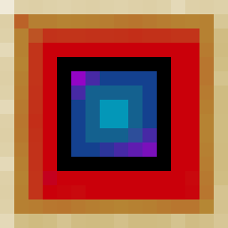
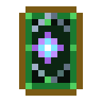
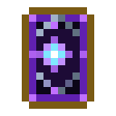
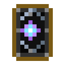
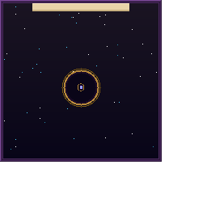
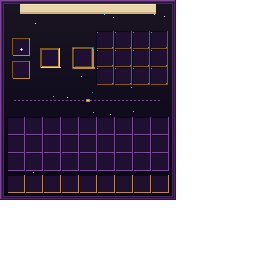
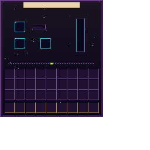

# Enchant Transfer

<div align="center">




**Extract, transfer, and combine enchantments through Magic Cards — now with colored cards, attachable modules, and an XP conversion system.**

[Website](https://arensis.github.io/enchant-transfer-mod/) · [CurseForge](https://www.curseforge.com/minecraft/mc-mods/enchant-transfer) · [Issues](https://github.com/arensis/enchant-transfer-mod/issues)

</div>

---

**Enchant Transfer** adds a craftable block — the **Transfer Table** — that lets you extract enchantments from any item into individual **Magic Cards**, apply those cards to other compatible items, and combine two cards of the same enchantment and level to upgrade them. All operations are free (no XP cost), and vanilla enchantment compatibility rules are respected.

Version 2.0 introduces the **Module System**: specialized blocks that attach to the Transfer Table on any face, extending its capabilities. The first module — the **Infusion Coil** — converts Magic Cards into stored XP and fills glass bottles into Bottles o' Enchanting.

**Requires:** Fabric Loader and Fabric API

---

## Core Features

### Extract

Place any enchanted item or book in the Transfer Table to strip its enchantments into individual Magic Cards, each one color-coded by category.

### Apply

Place a Magic Card and a target item in the Transfer Table. The enchantment transfers instantly, respecting vanilla incompatibility rules.

### Combine

Two cards of the same enchantment and level produce one card of the next level (up to vanilla maximum). Stacks work too — 5 + 6 cards yields 5 upgraded and 1 remainder.

### Zero Cost

All Transfer Table operations — extraction, application, and combination — are completely free. No XP, no materials consumed.

---

## Typed Magic Cards

     

Magic Cards are now color-coded by enchantment category. When you extract an enchantment, the Transfer Table automatically produces a card of the matching color.

| Card | Category | Enchantments |
|------|----------|-------------|
| 🔵 Blue | Protection | Protection, Fire Protection, Blast Protection, Projectile Protection, Feather Falling |
| 🟢 Green | Nature | Respiration, Aqua Affinity, Depth Strider, Silk Touch, Fortune |
| 🔴 Red | Combat | Sharpness, Smite, Bane of Arthropods, Impaling, Fire Aspect, Looting, Thorns, Sweeping Edge |
| 🟡 Yellow | Utility | Efficiency, Unbreaking, Mending, Swift Sneak, Infinity, Power, Punch |
| 🟣 Purple | Arcane | Channeling, Riptide, Loyalty, Frost Walker |
| ⚫ Black | Curse | Curse of Vanishing, Curse of Binding |

---

## Module System

The Transfer Table now works as a **hub**. Specialized module blocks can be placed on any of its 6 faces. Right-click the Transfer Table to open the **Selector Screen** — a visual hub showing all connected modules with their real-time status.

- Up to **6 modules** per Transfer Table (one per face)
- Each module type adds different functionality
- Navigate between the hub and any module using the **dot navigation bar**
- Modules show live status in the Selector — processing progress, tank levels, and connection state

### GUI Screens

<p>



</p>

*From left to right: Selector (hub with module sockets), Transfer Table Core (enchantment operations), Infusion Coil (XP conversion). Dynamic elements like wires, tank fills, and module icons are drawn by code on top of these backgrounds.*

---

## Infusion Coil

The first module for the Transfer Table. A vertical flask made of copper, brass, and glass that converts Magic Cards into XP.

### How it works

1. **Insert** a Magic Card into the card slot — the coil processes it over ~10 seconds
2. **XP is stored** in an internal tank (1,000 XP capacity)
3. **Place glass bottles** in the bottle slot to extract XP as Bottles o' Enchanting (7 XP per bottle)

Unenchanted cards yield a minimum of 5 XP; enchanted cards yield more based on their enchantment.

> **Tip:** The Infusion Coil stays vertical regardless of which face it's attached to. The copper connector stub always points toward the Transfer Table.

### Crafting Recipe

|   |   |   |
|---|---|---|
| Glass Bottle | Experience Bottle | Glass Bottle |
| Emerald | **Transfer Table** | Emerald |
| Glass Bottle | Amethyst Shard | Glass Bottle |

→ **Infusion Coil** × 1

---

## Transfer Table

### Crafting Recipe

|   |   |   |
|---|---|---|
| Gold Ingot | Gold Ingot | Gold Ingot |
| Redstone Dust | Redstone Dust | Redstone Dust |
| Coal | Diamond | Coal |

→ **Transfer Table** × 1

Requires an **iron pickaxe** or better to mine.

The 3D model reflects its recipe — gold on the outer edge, redstone in the middle ring, carbon-black inner layer, and a blue diamond core that glows from every angle.

---

## Compatibility

> **Worlds from 1.0.x are fully compatible.** Existing Transfer Tables keep working — the block ID hasn't changed. Old Magic Cards stored in chests retain their enchantment data. They will appear as the generic (blank) card variant; their functionality is unchanged. New cards extracted after updating will automatically use the color-coded system.

---

## Changelog — 2.0.0

- **Module System** — The Transfer Table is now a modular hub that accepts specialized blocks on any of its 6 faces
- **Infusion Coil** — First module: converts Magic Cards into XP, fills glass bottles into Bottles o' Enchanting
- **Typed Magic Cards** — 6 color-coded card variants by enchantment category (Protection, Nature, Combat, Utility, Arcane, Curse)
- **Selector Screen** — New hub GUI with live module status, wires, and processing indicators
- **Redesigned GUIs** — Dark starry aesthetic, golden/cyan accents, navigation dot bar, ghost input hints
- **New 3D models** — Custom Transfer Table model with stepped funnel and emissive diamond core; Infusion Coil flask with copper/brass/glass and fluid renderer
- **Block Entity Renderers** — Pulsing blue core for the Transfer Table; fluid fill animation, cap glow, and directional connector for the Infusion Coil

<details>
<summary>Previous versions</summary>

### 1.0.3

- Fixed block drop loot table, item translation key, and lang cleanup
- Updated Gradle wrapper to 9.5.0

### 1.0.2

- Migrated data pack paths to 1.21.4+ singular format (recipe/, loot_table/, tags/)
- Broadened minecraft version constraint to >=1.21.1

### 1.0.1

- Port to Minecraft 1.21.11
- Updated Fabric Loom to 1.14, Gradle to 9.2.0, Fabric API to 0.141.4+1.21.11
- Fixed all 1.21.4+ API changes (RegistryKey, DrawContext, ActionResult, etc.)

### 1.0.0

- Migrated to Minecraft 1.21.1 with CI/CD and release automation

</details>

---

## Installation

1. Install [Fabric Loader](https://fabricmc.net/use/) **≥ 0.19.2** for Minecraft 1.21.11
2. Download [Fabric API](https://modrinth.com/mod/fabric-api) and place it in the `mods/` folder
3. Download the mod JAR and place it in `mods/` as well
4. Launch Minecraft with the Fabric profile

> **Fabric API is required.** The mod will not start without it.

---

## Requirements

| Dependency | Version |
|------------|---------|
| Java | 21 |
| Minecraft | 1.21.11 |
| Fabric Loader | ≥ 0.19.2 |
| Fabric API | 0.141.4+1.21.11 |

---

## For Developers

### IDE Setup (IntelliJ IDEA)

1. Install the **Minecraft Development** plugin
2. Change build mode:
   - `Settings` → `Build, Execution, Deployment` → `Build Tools` → `Gradle`
   - `Build and run using` → **IntelliJ IDEA**
   - `Run test using` → **IntelliJ IDEA**
3. Set compiler output:
   - `File` → `Project Structure` → `Project Settings` → `Project`
   - `Project compiler output` → `$PROJECT_DIR$/out`

### Gradle Tasks

| Task | Description |
|------|-------------|
| `./gradlew build` | Compile and generate JAR in `build/libs/` |
| `./gradlew runClient` | Launch Minecraft with the mod loaded (client) |
| `./gradlew runServer` | Launch a Minecraft server with the mod |

> `runClient` and `runServer` don't require a separate Minecraft installation; Fabric Loom downloads assets automatically.

### Updating Dependencies

All versions are centralized in `gradle.properties`:

```properties
minecraft_version = 1.21.11
yarn_mappings     = 1.21.11+build.3
loader_version    = 0.19.2
fabric_version    = 0.141.4+1.21.11
java_version      = 21
```

Reference: https://fabricmc.net/versions.html

---

## License

This project is distributed under the **CC0-1.0** license. You may use, modify, and distribute the code without restrictions.
